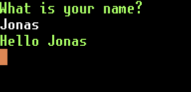
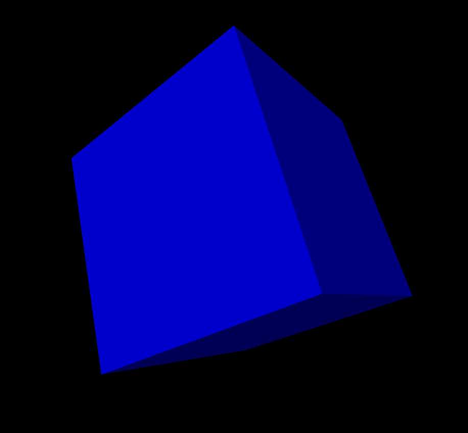
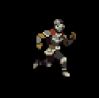

# PIXPY
:stylesheet: style_sheet.css
:source-highlighter: rouge
:rouge-style: molokai

 pip3 install pixpy

[.float-group]
--

[source,python]
----
import pixpy as pix
screen = pix.open_display(width=1280, height=7220)
con = pix.Console(cols=1280//16, rows=720//32)
con.write('What is your name?\n')
con.read_line()
while pix.run_loop():
    for e in pix.all_events():
        if isinstance(e, pix.event.Text):
            con.write(f"\nHello {e.text}")
            con.read_line()
    screen.draw(drawable=con, top_left=(0,0), size=screen.size)
    screen.swap()
----
--

[.float-group]
--

[source,python]
----
...
mat = make_x_mat(xa) @ make_y_mat(ya) @ make_z_mat(za)

points = [v @ mat for v in vertices]
norms = [v @ mat for v in normals]
p = [pix.Float2(v[0], v[1]) * (5/(v[2] + 4))
     * center.y/3 + center for v in points]

for i, quad in enumerate(quads):
    nz = -norms[i][2]
    screen.draw_color = pix.rgba(0, 0, nz, 1)
    screen.polygon([p[n] for n in quad])
...
----
--

[.float-group]
--

[source,python]
----
...
sprites = {}
with os.scandir('data/knight') as it:
    for entry in it:
        if not entry.name.endswith(".png"):
            continue
        name = os.path.splitext(entry.name)[0]
        sprites[name] = pix.load_png(entry.path).split(
                                     width=120, height=80)
...
    sheet = sprites["Run"]
    frame = (pos.x // 10) % 10
    img = sheet[frame]
    screen.draw(image=img, center=pos, size=img.size*dir)
...
----
--

[.float-group]
--

[source,python]
----
...
screen = pix.open_display(size=(1280, 720))
img = pix.Image(128, 128)
img.filled_circle(center=img.size/2, radius=img.size.x/2-1)
...
while pix.run_loop():
    screen.clear()
    for ball in balls:
        screen.draw_color = ball.color
        screen.draw(image=img, center=ball.pos,
                    size=img.size * (math.sin(p) + 2.0) * 0.25)
        ball.pos += ball.vel
...
----
--
# &nbsp;

 git clone https://github.com/sasq64/pixpy-examples.git
 code pixpy-examples