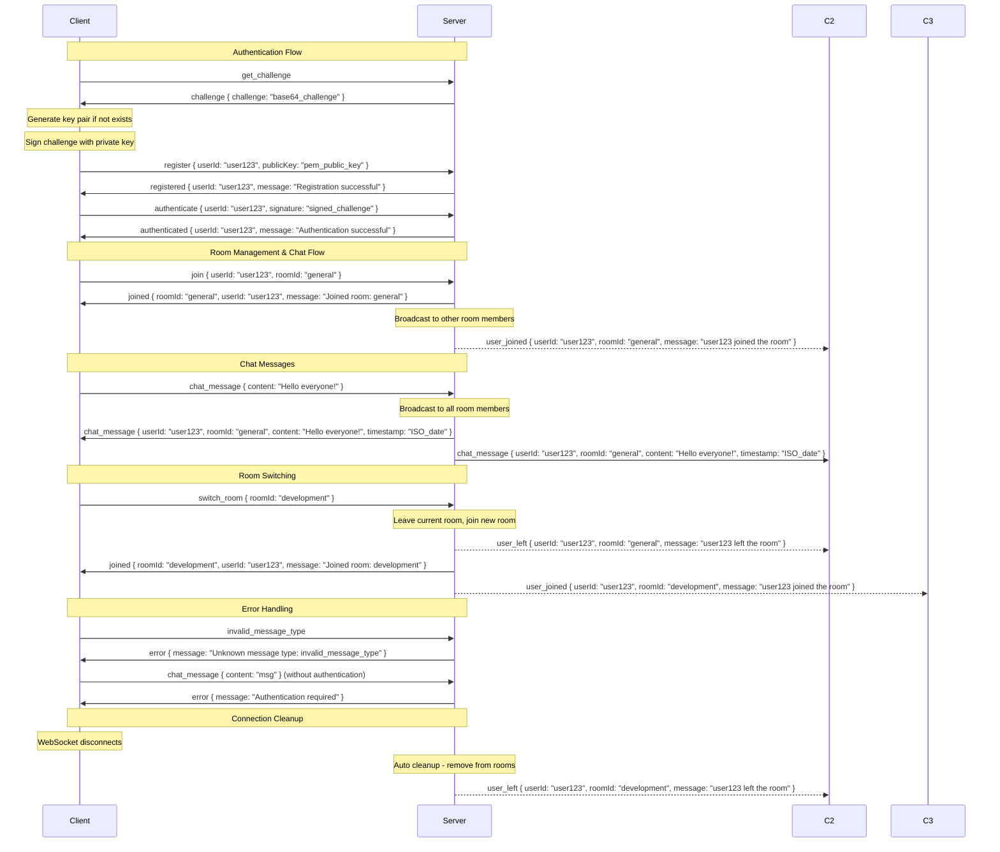

# WebSocket Chat Server - Message Sequence Diagram

## Message Flow Details

### 1. Authentication Sequence
- Client requests challenge for cryptographic authentication
- Server generates random challenge and stores it temporarily
- Client registers with userId and RSA public key (if not already registered)
- Client signs the challenge with private key and sends signature
- Server verifies signature against stored public key

### 2. Room Management
- After authentication, client joins a room (defaults to userId if no roomId specified)
- Server notifies other room members when users join/leave
- Users can switch rooms, which triggers leave/join sequence
- Empty rooms are automatically cleaned up

### 3. Chat Flow
- Authenticated users can send messages to their current room
- Server broadcasts messages to all room members with timestamp
- Messages include sender info and room context

### 4. Error Scenarios
- Invalid message types return error responses
- Unauthenticated requests are rejected
- Missing required fields trigger validation errors
- Rate limiting prevents spam registration attempts

### 5. Connection Lifecycle
- WebSocket connections are tracked with user/room state
- Disconnections automatically trigger room cleanup
- Challenge data is cleaned up on disconnect or timeout

## Key Security Features
- **RSA Authentication**: 2048-bit minimum key requirement
- **Challenge-Response**: Prevents replay attacks
- **Rate Limiting**: Registration attempts limited by IP
- **Session Management**: Authentication state tied to WebSocket connection